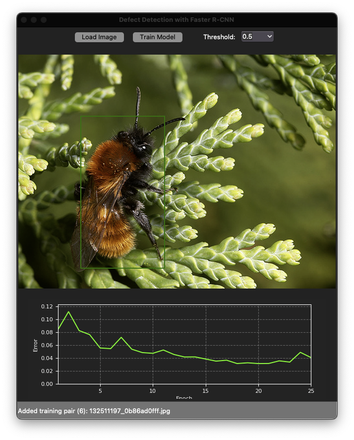

# Incremental Learning Trainer for Object Detection

A GUI-based application for training and fine-tuning object detection models incrementally using Faster R-CNN. This tool allows users to easily train object detection models on custom datasets without requiring extensive machine learning knowledge.



## Features

- **User-friendly GUI**: Simple interface for loading images and annotations
- **Drag and Drop Support**: Easily add training data by dragging image and annotation files
- **Incremental Learning**: Continue training an existing model with new data
- **Real-time Visualization**: View training progress and detection results
- **Customizable Detection Threshold**: Adjust confidence threshold for object detection
- **Model Persistence**: Save trained models for future use

## Requirements

- Python 3.6+
- PyTorch 1.7+
- torchvision
- tkinter
- tkinterdnd2
- PIL
- OpenCV
- NumPy
- Matplotlib

## Installation

1. Clone this repository:
```bash
git clone https://github.com/bemoregt/IncrementalLearning_Trainer_for_ObjectDetection.git
cd IncrementalLearning_Trainer_for_ObjectDetection
```

2. Install required packages:
```bash
pip install torch torchvision tkinter tkinterdnd2 pillow opencv-python numpy matplotlib
```

## Usage

1. Run the application:
```bash
python defect_detection_gui.py
```

2. **Load Training Data**:
   - Drag and drop image (.jpg, .png) files along with their corresponding annotation (.txt) files onto the canvas
   - Annotation files should be in YOLO format (class_id, x_center, y_center, width, height)

3. **Train the Model**:
   - Click "Train Model" to start training
   - Training progress and loss will be displayed in real-time
   - The trained model will be automatically saved

4. **Detect Objects**:
   - Load a test image using the "Load Image" button
   - Adjust detection threshold as needed
   - View detection results on the canvas

## Annotation Format

The application uses YOLO format annotations:
```
class_id x_center y_center width height
```
Where:
- `class_id`: Integer representing the object class (0-based)
- `x_center, y_center`: Normalized coordinates of the box center (0.0-1.0)
- `width, height`: Normalized width and height of the box (0.0-1.0)

## Model Architecture

The application uses Faster R-CNN with ResNet18-FPN backbone:
- ResNet18 feature pyramid network (FPN) backbone
- Region Proposal Network (RPN)
- RoI pooling and box regression heads

## Implementation Details

The application consists of two main classes:
1. `CustomDataset`: Handles loading and preprocessing of image and annotation data
2. `DefectDetectionGUI`: Implements the graphical interface and manages the training process

Key components:
- Training visualization with real-time loss plots
- Dynamic resizing of images for display
- Support for continuous learning on new data
- Configurable detection threshold

## License

MIT License

## Contributing

Contributions are welcome! Please feel free to submit a Pull Request.
